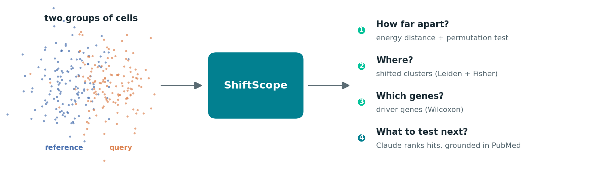
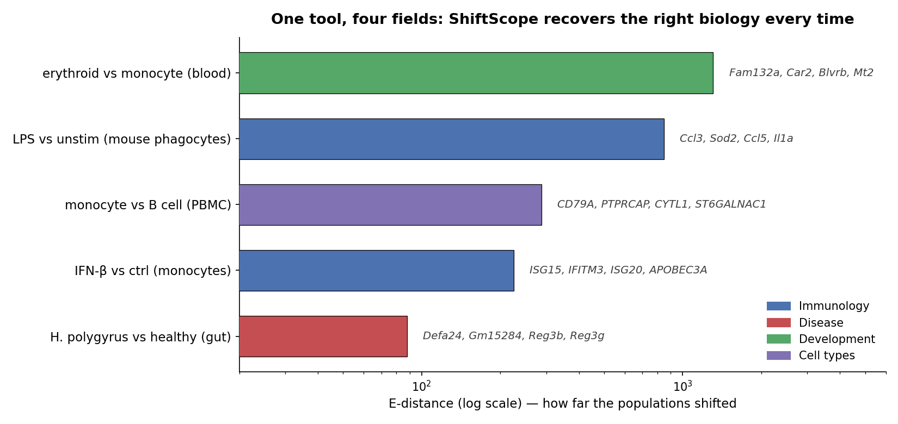
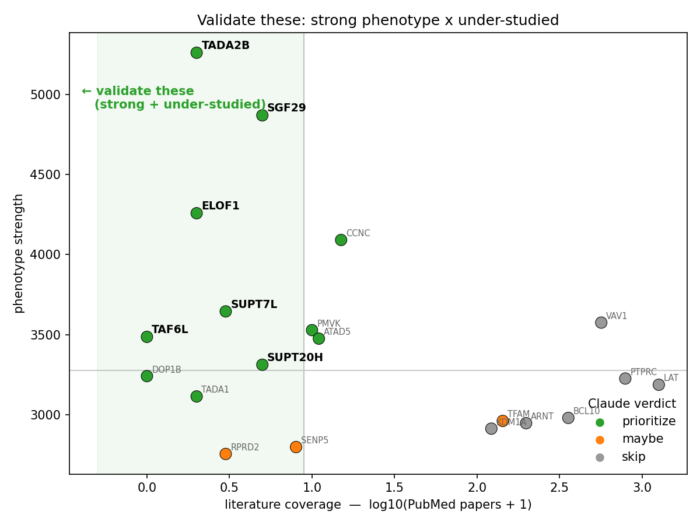
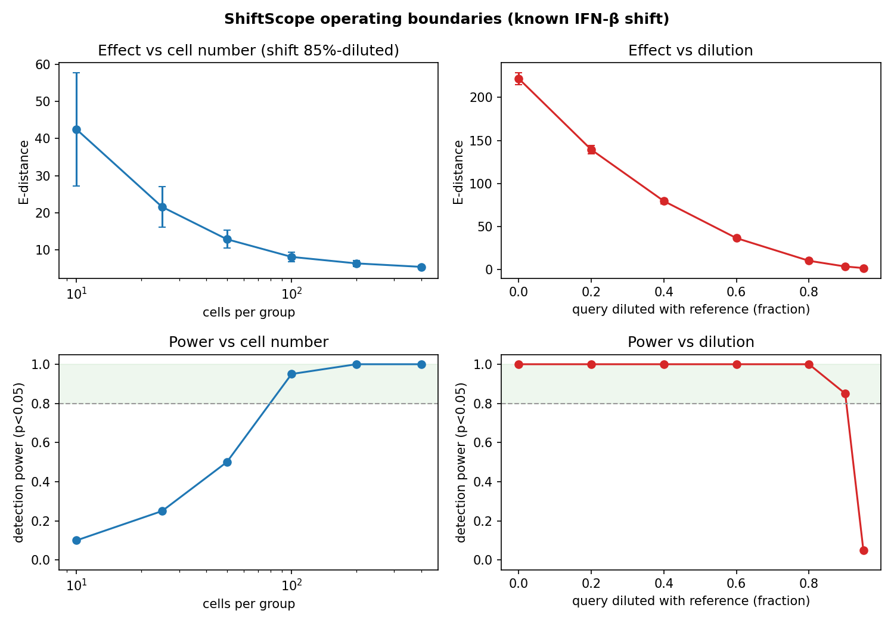

# ShiftScope

**Compare any two groups of single cells. Measure the shift, find the genes that drive it, and let Claude tell you what to test next.**

[](https://colab.research.google.com/github/aenorhabditis6/claude_science_hackathon/blob/main/quickstart.ipynb) &nbsp; 



Built for **Built with Claude: Life Sciences** (Anthropic × Gladstone). It is condition-agnostic: control vs perturbation, disease vs healthy, young vs old, cell type vs cell type. One tool, one workflow.

The whole project was written this week with **Claude Code**, and Claude runs inside the tool at runtime (via the Anthropic SDK) to write the interpretation and to score the prioritization, always grounded in numbers ShiftScope computed.

## See it in 20 seconds

Click the Colab badge above and **Run all**. Or, anywhere:

```python
from shiftscope.quickstart import run
run()   # ctrl vs IFN-β monocytes -> E-distance, driver genes, UMAP, and Claude's read
```

One line loads a real dataset, measures the shift, localizes it, finds the drivers, and (with a Claude key) writes the interpretation.

## One tool, four fields

The same code runs across immunology, host–pathogen disease, blood development, and cell-type identity, and recovers the correct, distinct biology each time. Nothing is hard-coded to one disease.



## The useful part: what to test next

Measuring a shift is easy. The real question is *which of hundreds of screen hits is worth a month at the bench.* On Alex Marson's genome-scale CD4+ T-cell CRISPR screen, ShiftScope ranks hits by **strong phenotype × under-studied**. Novelty is grounded in a **live PubMed count** (NCBI E-utilities), and Claude gives a keep/skip verdict using that real number, with the exact prompt and evidence logged. Famous genes (VAV1, CD45) drop; strong but obscure genes (the SAGA chromatin complex) rise to the top.



## How it works

| Step | Method |
|---|---|
| **Embed** | one PCA space fit on the pooled cells, so both groups are comparable (+ UMAP) |
| **Compare** | scPerturb **energy distance** with a permutation **E-test**; MMD and Sinkhorn **optimal transport** as cross-checks |
| **Localize** | **Leiden** clusters + per-cluster **Fisher exact** test (BH-corrected) -> clusters that gained/lost cells |
| **Drivers** | **Wilcoxon** rank-sum DE inside the shifted clusters -> top genes |
| **Interpret** | Claude turns the numbers into a cited write-up; every claim points to a value we passed in |
| **Prioritize** | phenotype strength × PubMed coverage -> Claude keep/skip verdict -> a "validate these" shortlist |

Every Claude call logs its exact prompt and the evidence it was given, so each claim traces back to data. See a real [interpretation log](examples/interpret_kang_ifnb.example.json) and [prioritization log](examples/prioritize_marson.example.json).

## We checked where it breaks

Detection power measured over many random draws, not one lucky p-value. It needs about 100 cells per group for a subtle shift, and detects a shift until it is diluted below ~10% of its true size.



## Datasets

`io.load_public(name, reference, query, ...)` ships ready-made datasets across domains:

| name | domain | comparison |
|---|---|---|
| `kang` · `hagai` · `dong` | immunology | PBMC ± IFN-β · phagocytes ± LPS · multi-IFN |
| `haber` | disease | gut epithelium, healthy vs *Salmonella* / *H. polygyrus* |
| `paul15` | development | hematopoiesis, any two differentiation states |
| `shifrut` | drug target | human T cells, 20-gene CRISPR screen ± TCR stim |
| `pbmc68k` · `pbmc3k` | cell types | any two annotated cell types |

Any local `.h5ad` works via `io.load(path, condition_key, reference, query)`. For scale, `io.load_demo()` streams Marson's 140 GB CRISPR Perturb-seq (GSE314342) from S3 without downloading it.

## More

- **Full walkthrough:** [`demo.ipynb`](demo.ipynb) (prioritization, calibration, the Shifrut and Marson rankings, more datasets).
- **App:** `python -m shiftscope.app` launches a Gradio UI (compare tab + prioritize tab).
- **Methods build on** [scPerturb](https://www.nature.com/articles/s41592-024-02144-6) (E-distance / E-test, Peidli et al. 2024), [POT](https://pythonot.github.io/) (optimal transport), and scanpy / anndata.

## License

MIT.
